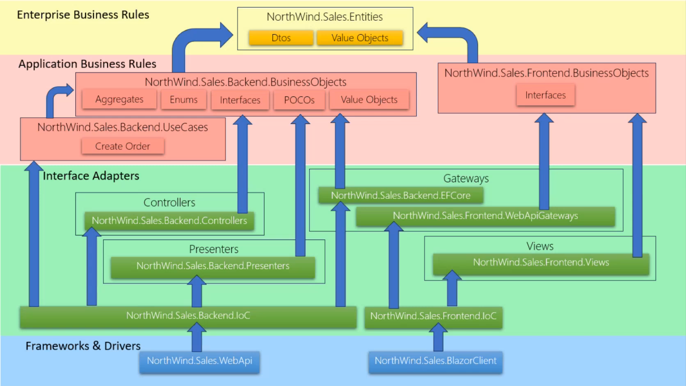

# Clean Architecture .NET_ITCapacitacion-enero2024

https://ticapacitacion.com/curso/introca/

https://www.youtube.com/watch?v=3RvCwsbPUU8&list=PLsi0_y2gnnl6zf4btN7pHWFIgxdsQlgxI

----


---

## **DTO (Data Transfer Object)**  
Es un patrón de diseño que se usa para transferir datos entre distintas capas de una aplicación, sin lógica de negocio. Su propósito principal es reducir la cantidad de llamadas y mejorar la eficiencia del sistema.  

📌 **Características:**  
- Contiene solo datos (atributos) y getters/setters.  
- No tiene comportamiento ni lógica de negocio.  
- Se usa comúnmente en APIs para enviar y recibir información.  

🔹 **Ejemplo en C#:**  
```csharp
public class UserDto
{
    public int Id { get; set; }
    public string Name { get; set; }
    public string Email { get; set; }
}
```  

---

## **Value Object (VO)**  
Son objetos que representan conceptos del dominio, definidos únicamente por sus valores y no por una identidad única. Son **inmutables**, lo que significa que no cambian después de ser creados.  

📌 **Características:**  
- No tienen una identidad única como las entidades.  
- Son inmutables: si se necesita un cambio, se crea un nuevo objeto.  
- Se comparan por sus valores y no por referencias.  

🔹 **Ejemplo en C#:**  
```csharp
public record Money(decimal Amount, string Currency);
```
Aquí `Money` es un Value Object porque si dos instancias tienen el mismo `Amount` y `Currency`, se consideran iguales.  

---

## **Aggregates**  
Un Aggregate es un grupo de entidades y objetos de valor que se consideran una unidad dentro del dominio. Tiene una entidad raíz (**Aggregate Root**) que controla la consistencia y protege las demás entidades.  

📌 **Características:**  
- Garantiza la consistencia de los datos dentro de la unidad.  
- La entidad raíz gestiona el ciclo de vida de las entidades internas.  
- Se accede a las entidades solo a través de la raíz del Aggregate.  

🔹 **Ejemplo en C#:**  
```csharp
public class Order // Aggregate Root
{
    public int Id { get; private set; }
    private List<OrderItem> _items = new();

    public void AddItem(OrderItem item)
    {
        _items.Add(item);
    }
}
```
Aquí, `Order` es el **Aggregate Root** y `OrderItem` es una entidad dentro del Aggregate.  

---

## **Enums (Enumeraciones)**  
Son un tipo de dato especial que representa un conjunto de valores constantes y predefinidos, usados para representar opciones limitadas, como estados o categorías.  

📌 **Características:**  
- Definen valores constantes con nombres legibles.  
- Evitan el uso de números mágicos en el código.  
- Mejoran la legibilidad y mantenimiento del código.  

🔹 **Ejemplo en C#:**  
```csharp
public enum OrderStatus
{
    Pending,
    Shipped,
    Delivered,
    Canceled
}
```
Aquí `OrderStatus` define los estados posibles de una orden.  

---

## **Interfaces**  
Son contratos que definen métodos sin proporcionar implementación. Permiten la abstracción y ayudan a seguir principios como **la inversión de dependencias** y **la programación orientada a interfaces**.  

📌 **Características:**  
- No contienen implementación, solo la firma de los métodos.  
- Se implementan en clases para definir su comportamiento.  
- Facilitan la inyección de dependencias y pruebas unitarias.  

🔹 **Ejemplo en C#:**  
```csharp
public interface IPaymentService
{
    void ProcessPayment(decimal amount);
}
```
Cualquier clase que implemente `IPaymentService` debe definir `ProcessPayment`.  

---

## **POCOs (Plain Old CLR Objects)**  
Son clases simples en .NET que no dependen de frameworks específicos. Se usan en modelos de datos y en la arquitectura limpia para mantener separación de responsabilidades.  

📌 **Características:**  
- No heredan de clases base de frameworks.  
- No contienen lógica innecesaria ni dependencias.  
- Son fáciles de serializar y almacenar en bases de datos.  

🔹 **Ejemplo en C#:**  
```csharp
public class Product
{
    public int Id { get; set; }
    public string Name { get; set; }
    public decimal Price { get; set; }
}
```
Aquí `Product` es un **POCO** porque solo representa datos sin lógica extra.  
---

## **Use Cases**  
Son clases o servicios que representan casos de uso específicos en una aplicación. Encapsulan la lógica de negocio y se encargan de coordinar las operaciones necesarias para completar una acción.  

📌 **Características:**  
- Siguen el principio de **separación de responsabilidades**.  
- Se encargan de la ejecución de una acción específica.  
- No dependen de detalles de infraestructura (bases de datos, UI, etc.).  

🔹 **Ejemplo en C#:**  
```csharp
public class CreateOrderUseCase
{
    private readonly IOrderRepository _orderRepository;

    public CreateOrderUseCase(IOrderRepository orderRepository)
    {
        _orderRepository = orderRepository;
    }

    public void Execute(OrderDto order)
    {
        var newOrder = new Order(order.Id, order.CustomerId);
        _orderRepository.Save(newOrder);
    }
}
```
Aquí, `CreateOrderUseCase` representa un caso de uso de creación de una orden.  

---

## **Controllers**  
En el contexto de una API o una aplicación web, los controladores manejan las solicitudes del usuario y delegan la lógica a los **Use Cases** o servicios.  

📌 **Características:**  
- Son responsables de recibir peticiones y devolver respuestas.  
- No deben contener lógica de negocio, solo llamar a los **Use Cases**.  
- Se usan en patrones como MVC y Clean Architecture.  

🔹 **Ejemplo en C# (Web API con ASP.NET):**  
```csharp
[ApiController]
[Route("api/orders")]
public class OrderController : ControllerBase
{
    private readonly CreateOrderUseCase _createOrderUseCase;

    public OrderController(CreateOrderUseCase createOrderUseCase)
    {
        _createOrderUseCase = createOrderUseCase;
    }

    [HttpPost]
    public IActionResult CreateOrder([FromBody] OrderDto order)
    {
        _createOrderUseCase.Execute(order);
        return Ok("Order created successfully");
    }
}
```
Aquí, `OrderController` maneja la solicitud HTTP y delega la lógica al caso de uso.  

---

## **Gateways**  
En Clean Architecture, los **Gateways** son interfaces o adaptadores que permiten la comunicación entre la aplicación y servicios externos, como bases de datos, APIs o almacenamiento.  

📌 **Características:**  
- Son abstracciones que facilitan la interacción con el mundo externo.  
- Permiten cambiar implementaciones sin afectar la lógica del negocio.  
- Se implementan mediante **interfaces** para permitir la inyección de dependencias.  

🔹 **Ejemplo en C#:**  
```csharp
public interface IOrderRepository
{
    void Save(Order order);
}
```
Luego, una implementación concreta puede interactuar con una base de datos:  
```csharp
public class OrderRepository : IOrderRepository
{
    public void Save(Order order)
    {
        // Código para guardar la orden en la base de datos
    }
}
```
Aquí, `IOrderRepository` es un **Gateway** y `OrderRepository` es su implementación.  

---

## **Presenters**  
Son responsables de transformar los datos de los casos de uso en un formato adecuado para la vista (UI). Se usan en patrones como **MVP (Model-View-Presenter)** y **Clean Architecture**.  

📌 **Características:**  
- Transforman la respuesta de los casos de uso para la vista.  
- Separan la lógica de presentación de la lógica de negocio.  
- Ayudan a desacoplar la UI del dominio.  

🔹 **Ejemplo en C#:**  
```csharp
public class OrderPresenter
{
    public OrderViewModel Present(Order order)
    {
        return new OrderViewModel
        {
            OrderId = order.Id,
            Customer = order.CustomerId,
            Status = order.Status.ToString()
        };
    }
}
```
Aquí, el `OrderPresenter` transforma un objeto `Order` en un `OrderViewModel` listo para la UI.  

---

## **Views**  
En una aplicación, las **Views** representan la interfaz de usuario. Pueden ser componentes HTML, páginas Blazor, o vistas en un framework MVC.  

📌 **Características:**  
- Se encargan de mostrar los datos al usuario.  
- Pueden recibir datos de los **Presenters** o **ViewModels**.  
- No deben contener lógica de negocio.  

🔹 **Ejemplo en Blazor:**  
```razor
@page "/order"

<h3>Order Details</h3>
<p>Order ID: @OrderId</p>
<p>Customer: @Customer</p>

@code {
    [Parameter] public string OrderId { get; set; }
    [Parameter] public string Customer { get; set; }
}
```
Aquí, la vista muestra los datos de una orden en una página Blazor.  

---

## **Web API**  
Es una API basada en HTTP que permite la comunicación entre sistemas. Se usa para exponer datos y funcionalidades a clientes como aplicaciones web, móviles o terceros.  

📌 **Características:**  
- Utiliza **REST** o **GraphQL** como arquitecturas comunes.  
- Expone **endpoints** accesibles mediante HTTP.  
- Generalmente devuelve datos en **JSON** o **XML**.  

🔹 **Ejemplo en C# (ASP.NET Web API):**  
```csharp
[ApiController]
[Route("api/orders")]
public class OrderApiController : ControllerBase
{
    private readonly IOrderRepository _orderRepository;

    public OrderApiController(IOrderRepository orderRepository)
    {
        _orderRepository = orderRepository;
    }

    [HttpGet("{id}")]
    public ActionResult<OrderDto> GetOrder(int id)
    {
        var order = _orderRepository.GetById(id);
        return Ok(order);
    }
}
```
Aquí, `OrderApiController` expone un endpoint para obtener órdenes vía HTTP.  

---

## **BlazorClient**  
Es un modelo de ejecución de Blazor donde la aplicación se ejecuta completamente en el navegador usando WebAssembly.  

📌 **Características:**  
- Permite crear **aplicaciones SPA (Single Page Applications)** en .NET.  
- Se ejecuta en el navegador sin necesidad de JavaScript.  
- Usa WebAssembly para ejecutar código C# en el cliente.  

🔹 **Ejemplo en Blazor WebAssembly:**  
```razor
@page "/counter"

<h3>Counter</h3>
<p>Current count: @count</p>
<button @onclick="IncrementCount">Click me</button>

@code {
    private int count = 0;

    private void IncrementCount()
    {
        count++;
    }
}
```
Aquí, `Counter.razor` representa un componente en Blazor Client.  

---

### **Resumen rápido**  
| Concepto | Descripción |
|----------|------------|
| **Use Cases** | Contienen la lógica de negocio y coordinan acciones. |
| **Controllers** | Manejan solicitudes HTTP y delegan a los Use Cases. |
| **Gateways** | Abstracciones para acceder a servicios externos. |
| **Presenters** | Transforman datos para la UI. |
| **Views** | Interfaz de usuario (HTML, Blazor, etc.). |
| **Web API** | API basada en HTTP para exponer datos y funcionalidades. |
| **BlazorClient** | Aplicaciones Blazor que se ejecutan en el navegador con WebAssembly. |

Estos conceptos forman parte de arquitecturas como **Clean Architecture**, **MVC**, y **Blazor**. 🚀

